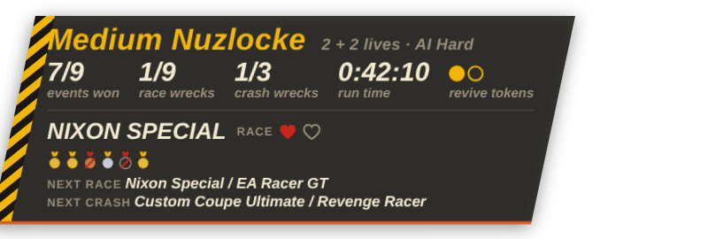
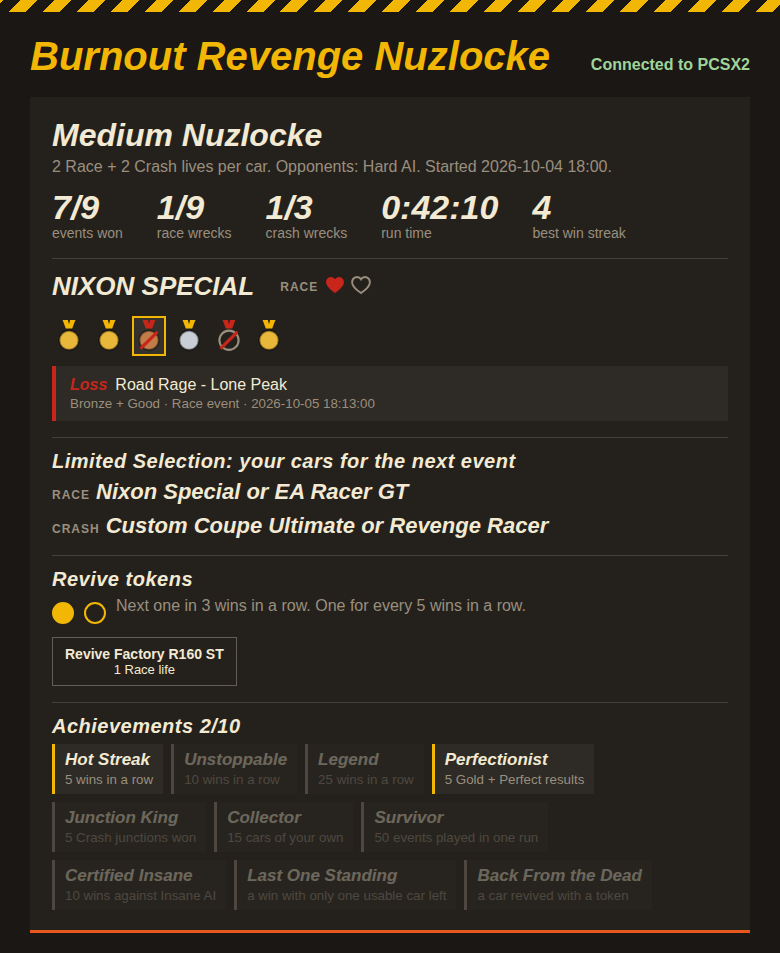

<h1 align="center">Burnout Revenge Nuzlocke</h1>

<p align="center">
  <b>A Nuzlocke challenge mod for Burnout Revenge on PS2 (PCSX2).</b><br>
  Limited lives per car. Hit the mark or it costs you. Opponents that don't let up.
</p>

<p align="center">
  
  
  
</p>

<p align="center">
  
</p>

---

## The rules

| | |
|---|---|
| **Lives** | Every car has two pools of lives, one for **Race** events (everything except Crash junctions) and one for **Crash** junctions: **3 + 3** on Easy, **2 + 2** on Medium, **1 + 1** on Hard. Crash cars only have the Crash pool, since they can't race. |
| **Winning** | Every event must reach the difficulty's mark: at least **Silver + Great** on Easy, **Silver + Awesome** on Medium, **Gold + Perfect** on Hard. Anything less costs the car you drove a life. Crash junctions and Preview events count too. |
| **Wrecked** | A car out of Race lives can't be selected in the garage (`[RACE X]`); out of Crash lives, it can't be picked in crash junctions (`[CRASH X]`); out of both, it's `[WRECKED]`. |
| **No escape** | Retry and Quit in the pause menu don't work, so you can't bail out of an event to save a life, and Retry on the results screen just continues. |
| **Harder AI** | Opponents corner faster, keep their pace, come back hard when they fall behind, and go for takedowns more often and harder. |
| **Run's dead** | When every car that can race is wrecked for Race events, **or** every crash car is wrecked for Crash junctions, the run is over: the game stays on the results screen until you shut it down, choose **Grace mode** (where nothing counts) or start a new run. A car unlocked by the event that ended the run doesn't save it, and a car only loaned to you (Burning Lap, Preview) doesn't count until you unlock it. |

Inspired by the [Need for Speed Underground Nuzlocke mod](https://github.com/xan1242/NFSU-nuzlocke).

## What's included

| | |
|---|---|
| 🛠️ **The patch** ([`patches/SLUS-21242_D224D348.pnach`](patches/SLUS-21242_D224D348.pnach)) | Native game code changes: blocks wrecked cars, blocks pause-menu Retry/Quit, signals every finished event to the tracker, three Harder AI levels (speed and aggression), plus optional widescreen 16:9 and 60 FPS menus. |
| 📊 **The tracker** ([`bin/nuzlocke.exe`](bin/nuzlocke.exe)) | Judges every result, counts lives, wrecks cars, and keeps your run's stats. No install, no Python. |
| 🎥 **Stream overlay** | A Burnout-style HUD plate for OBS, served by the tracker. |
| 💿 **ISO patcher** ([`bin/nuzlocke_isopatch.exe`](bin/nuzlocke_isopatch.exe)) | Builds the whole patch into your own copy of the game (one ISO per AI level, widescreen and 60 FPS optional), so no `.pnach` is needed. |

<p align="center">
  
</p>

## Download

Get **BurnoutRevengeNuzlocke-V1.1.1.zip** from the [latest release](../../releases/latest), or from [`releases/`](releases/BurnoutRevengeNuzlocke-V1.1.1.zip) in this repository. It contains both programs, the `.pnach`, a quick-start `README.txt` and the start-up guide. See the [changelog](CHANGELOG.md) for what's in each version.

## Quick start

You need the **US version of Burnout Revenge (SLUS-21242)**, **PCSX2 2.x** on Windows, and the files from the download. The full walkthrough, good practices and FAQ are in the **[Start-up guide](docs/GUIDE.md)**.

1. **In PCSX2, turn on PINE** (Settings → Advanced, slot 28011).
2. **Add the patch, either:**
   - copy `patches/SLUS-21242_D224D348.pnach` into PCSX2's `patches` folder, then in the game's Properties → Patches tick **Block dead cars in garage**, **Block pause-menu Retry and Quit**, **one** Harder AI level, and if you like **Widescreen 16:9** and **60 FPS menus and crash mode**; **or**
   - drag your ISO onto `bin/nuzlocke_isopatch.exe`, pick a level and the extras, and play the ISO it makes.
3. **Run `bin/nuzlocke.exe`.** The control page opens at `http://localhost:8765`. Pick a difficulty to start a run.
4. **For streaming,** add a Browser Source in OBS: `http://localhost:8765/overlay`, about 800 × 400.

## Difficulty

There are two separate settings: lives are chosen in the tracker when you start a run, and the AI level comes from the patch. Mix them however you like.

| Lives (tracker) | | Harder AI (patch) | Cornering | Pace when out of sight | Speed limit | Catch-up | Eases off |
|---|---|---|---|---|---|---|---|
| **Easy** | 3 + 3 per car | **Easy** | 86.25% of the line's limit | 1.5–4.5 s per section quicker | 217 mph | from 40 m behind, up to +40 mph | 40 m ahead: 90% of your speed |
| **Medium** | 2 + 2 per car | **Medium** | 91.25% | 3.5–6.5 s quicker | 239 mph | from 25 m behind, up to +60 mph | 70 m ahead: 94% |
| **Hard** | 1 + 1 per car | **Hard** | 96.25% | 5.5–8.5 s quicker | 251 mph | from 10 m behind, up to +81 mph | 100 m ahead: 97% |
| | | ⚠️ **Insane** | 97.5% | 6–9 s quicker | 257 mph | from 10 m behind, up to +89 mph | 100 m ahead: 97% |

Each Harder AI level also makes opponents more aggressive, through the game's own attack settings:

| Harder AI | Attacks when its aggression is at least | Time between attacks | Starts an attack from | First attack after the start | Blocks you for | Slam / shunt force |
|---|---|---|---|---|---|---|
| Stock game | 0.2 | 0.38–3 s | 40 m ahead, 70 m behind | 3 s | 3–8 s, from 15 m | 30–40 |
| **Easy** | 0.1 | 0.3–2.25 s | 50 m ahead, 85 m behind | 2 s | 3.5–9 s, from 20 m | +15% |
| **Medium** | 0.05 | 0.25–1.5 s | 60 m ahead, 100 m behind | 1.5 s | 4–10 s, from 25 m | +30% |
| **Hard** | 0 (every opponent) | 0.2–1 s | 75 m ahead, 120 m behind | 1 s | 5–12 s, from 30 m | +50% |
| ⚠️ **Insane** | 0 (every opponent) | 0.1–0.5 s | 100 m ahead, 150 m behind | 0.5 s | 6–15 s, from 40 m | +100% |

**Insane** is not meant to be fair: it keeps the full speed Hard had before the aggression was added and has opponents attacking almost constantly. With 1 + 1 lives, expect most runs to end within a few events. The ISO patcher asks you to confirm it.

Each opponent has its own aggression (0 to 1); the more aggressive it is, the shorter its wait between attacks. Slams also last longer, opponents try for longer to get into slamming position, and a rubbed opponent recovers sooner. Details are in the [aggression research notes](docs/research/ai-aggression.md).

The stock game corners at 80%, eases off when an opponent gets ahead of its pace, caps opponents at 197 mph, and has no catch-up towards you beyond short duels. How it all works is in the [AI research notes](docs/research/ai-catchup.md).

## Repository layout

```
patches/    the .pnach (source of truth for every game change)
bin/        ready-to-run Windows programs: tracker and ISO patcher
tracker/    tracker source (Go): memory reading, rules, control page and overlay
isopatch/   ISO patcher source (Go); patches.go is generated from the .pnach
tools/      research and build scripts (Python): ps2scan memory search, patch builders, ISO checker
docs/       start-up guide, research notes, images
legacy/     the original Python tracker, kept for reference (no Harder AI support)
```

## Building from source

The programs are plain Go with no dependencies (Go 1.22 or newer).

```sh
cd tracker  && GOOS=windows GOARCH=amd64 go build -trimpath -ldflags "-s -w" -o ../bin/nuzlocke.exe .
cd isopatch && GOOS=windows GOARCH=amd64 go build -trimpath -ldflags "-s -w" -o ../bin/nuzlocke_isopatch.exe .
cd tracker  && go test ./...
```

To retune the AI, edit the table in `tools/build_harder_ai.py` and run it. After changing the `.pnach`, regenerate the ISO patcher's data with `python tools/build_isopatch.py`. To check a patched ISO against the `.pnach`, run `python tools/verify_isopatch.py <original SLUS_212.42> <patched ISO> <Easy|Medium|Hard|Insane>` (needs `pip install pycdlib`).

## Research tools

[`tools/ps2scan.py`](tools/ps2scan.py) is the memory search tool everything here was found with. It takes labeled snapshots of PS2 RAM through PCSX2 and finds values that differ between situations, with extras for floats, speeds, live watching, text lookup and disassembly (`pip install pymem pefile numpy rabbitizer`). Run it and type `help` for the commands.

## Credits and disclaimer

- The idea and rules come from the [Need for Speed Underground Nuzlocke mod](https://github.com/xan1242/NFSU-nuzlocke) by xan1242.
- Widescreen 16:9 and 60 FPS: "16:9 HUD Scale & 60 FPS Fix" by SuperType1/remco.
- Text ID hashes were checked against the IDs on The Cutting Room Floor's ([tcrf.net](https://tcrf.net)) Burnout Revenge prototype page.
- This is a fan project, not affiliated with or endorsed by Criterion Games or Electronic Arts. **No game files are included.** You need your own copy of the game, and the ISO patcher only works on a clean US release.
